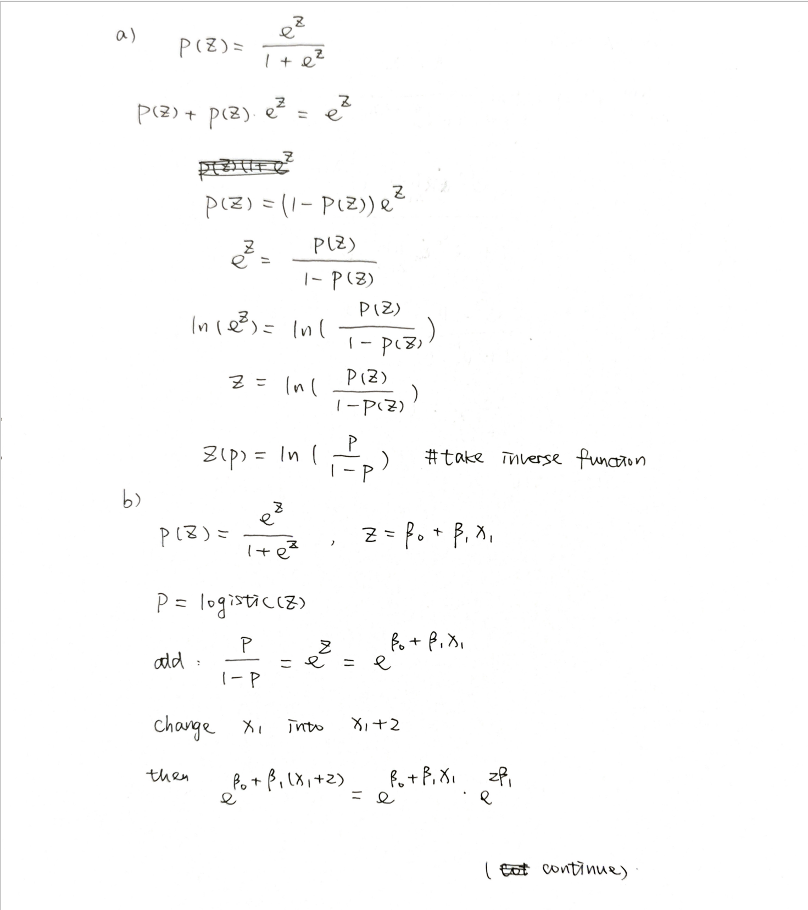
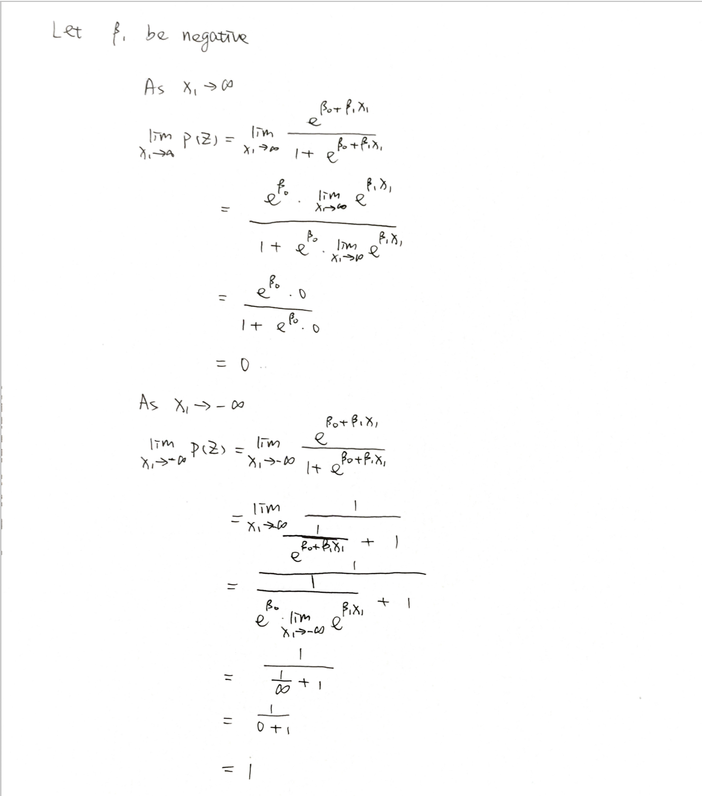

```{r setup, echo=FALSE}
library(knitr)
# set global chunk options: images will be 7x5 inches
knitr::opts_chunk$set(fig.width=7, fig.height=5)
options(digits = 8)


## indents are for indenting r code as formatted text
## They may need to be adjusted depending on your OS
# if your output looks odd, increase or decrease indent
indent1 = '    '
indent2 = '        '
indent3 = '            '
```

```{r echo = T, results = 'hide', message=FALSE}
#install.packages("tidyverse")
#install.packages("tidymodels")
#install.packages("ISLR")
#install.packages("corrr")
#install.packages("discrim")
#install.packages("poissonreg")
#install.packages("klaR")
tinytex::install_tinytex
library(tidyverse)
library(tidymodels)
library(ISLR)
library(ggplot2)
library(corrplot)
library(ggthemes)
library(yardstick)
library(dplyr)
library(magrittr)
library(corrr)
library(discrim)
library(poissonreg)
library(klaR)
tidymodels_prefer()
set.seed(100)
```

```{r}
# Get the dataset
tt <- read.csv("titanic.csv")
tt$survived <- factor(tt$survived,levels = c("Yes", "No"))
tt$pclass <- as.factor(tt$pclass)
head(tt)
```
## Q1
```{r}
#Split the data and check the the observations
tt_split <- initial_split(tt, prop = 0.80,
                          strata = survived)
tt_train <- training(tt_split)
tt_test <- testing(tt_split)
c(nrow(tt_train),nrow(tt_test),nrow(tt))
712/891
179/891
```
There are about 80% observations in the training set and 20% observations in the testing set, which is the same proportion as we split in our function.
```{r}
#check the missing value
sapply(tt_train, function(x) sum(is.na(x)))
```
There are some missing values in the training data. Most of them are in the age and cabin columns.
It is important to use the stratified sampling in this data, because it ensures that the number of data points in the training data is equivalent to the proportions in the original data set. We want to keep survive proportion for training data the same in original data.
  
## Q2
```{r}
tt_train %>% 
  ggplot(aes(x = survived)) +
  geom_bar()
summary(tt_train$survived)
273/(439+273)
```
According to the bar plot output, the number of not survived is obviously more than the number of survived. About 38% people survived and 62% not survived.
  
## Q3
```{r}
cor_tt <- tt_train[,sapply(tt_train,is.numeric)] %>% 
  correlate()
rplot(cor_tt)

cor_tt %>%
  stretch() %>%
  ggplot(aes(x, y, fill = r)) +
  geom_tile() +
  geom_text(aes(label = as.character(fashion(r))))
```
According to the output. Age is negatively correlated with number of siblings and spouses aboard and number of parents and children aboard. The number of parents and children aboard is positively correlated with number of siblings and spouses aboard and with passenger fare. The fare is also positively correlated with number of siblings and spouses aboard. The rest are weakly correlated or uncorrelated.
  
## Q4
```{r}
tt_recipe <- recipe(survived ~ pclass + sex + age +
                           sib_sp + parch + fare, data = tt_train) %>%
  step_impute_linear(age) %>% 
  step_dummy(all_nominal_predictors()) %>% 
  step_interact(~ starts_with("sex"):fare + age:fare)
```
  
## Q5
```{r}
log_reg <- logistic_reg() %>% 
  set_engine("glm") %>% 
  set_mode("classification")

log_wkflow <- workflow() %>% 
  add_model(log_reg) %>% 
  add_recipe(tt_recipe)

log_fit <- fit(log_wkflow, tt_train)
```
  
## Q6
```{r}
lda_mod <- discrim_linear() %>% 
  set_mode("classification") %>% 
  set_engine("MASS")

lda_wkflow <- workflow() %>% 
  add_model(lda_mod) %>% 
  add_recipe(tt_recipe)

lda_fit <- fit(lda_wkflow, tt_train)
```
  
## Q7
```{r}
qda_mod <- discrim_quad() %>% 
  set_mode("classification") %>% 
  set_engine("MASS")

qda_wkflow <- workflow() %>% 
  add_model(qda_mod) %>% 
  add_recipe(tt_recipe)

qda_fit <- fit(qda_wkflow, tt_train)
```
  
## Q8
```{r}
nb_mod <- naive_Bayes() %>% 
  set_mode("classification") %>% 
  set_engine("klaR") %>% 
  set_args(usekernel = FALSE)

nb_wkflow <- workflow() %>% 
  add_model(nb_mod) %>% 
  add_recipe(tt_recipe)

nb_fit <- fit(nb_wkflow, tt_train)
```
  
## Q9
```{r,warning=FALSE,message=FALSE}
log_predict <- predict(log_fit, new_data = tt_train, type = "class")

lda_predict <- predict(lda_fit, new_data = tt_train, type = "class")

qda_predict <- predict(qda_fit, new_data = tt_train, type = "class")

nb_predict <- predict(nb_fit, new_data = tt_train, type = "class")


tt_train_predict <- bind_cols(log_predict, lda_predict, qda_predict, nb_predict, tt_train$survived)


log_reg_acc <- augment(log_fit, new_data = tt_train) %>%
  accuracy(truth = survived, estimate = .pred_class)

lda_acc <- augment(lda_fit, new_data = tt_train) %>% 
  accuracy(truth = survived, estimate = .pred_class)

qda_acc <- augment(qda_fit, new_data = tt_train) %>% 
  accuracy(truth = survived, estimate = .pred_class)

nb_acc <- augment(nb_fit, new_data = tt_train) %>% 
  accuracy(truth = survived, estimate = .pred_class)


accuracies <- c(log_reg_acc$.estimate, lda_acc$.estimate, 
                nb_acc$.estimate, qda_acc$.estimate)

models <- c("Logistic Regression", "LDA", "Naive Bayes", "QDA")

results <- tibble(accuracies = accuracies, models = models)
results %>% 
  arrange(-accuracies)

```
According to the output, Logistic Regression achieved the highest accuracy on the training data.
  
## Q10
```{r}
predict(log_fit, new_data = tt_test, type = "class")

multi_metric <- metric_set(accuracy, sensitivity, specificity)

augment(log_fit, new_data = tt_test) %>%
  multi_metric(truth = survived, estimate = .pred_class)

augment(log_fit, new_data = tt_test) %>%
  conf_mat(truth = survived, estimate = .pred_class) 

augment(log_fit, new_data = tt_test) %>%
  roc_curve(survived, .pred_No) %>%
  autoplot()

augment(log_fit, new_data = tt_test) %>%
  roc_auc(survived, .pred_Yes)
```
The accuracy of the model on the testing data is approximately 86.75%. Thus, the model fits pretty well on the tests data. 

Both the accuracy of training and testing are above the 80%, but the accuracy of testing data is little bit higher than the training one. It may be caused by the smaller sample size of the testing data.

# 231 part
## Q11
Given that
$$
p(z) = \left(\frac{e^z}{1+e^z}\right)
$$
we have
$$
\begin{aligned}
p(z) + p(z)e^z&=e^z
\\
p(z) &= (1-p(z))e^z
\\
e^z&=\frac{p(z)}{1-p(z)}
\\
ln(e^z)&=ln\left(\frac{p(z)}{1-p(z)}\right)
\\
z&=ln\left(\frac{p(z)}{1-p(z)}\right)
\\
z(p)&=ln\left(\frac{p}{1-p}\right)
\end{aligned}
$$
  
## Q12

\newpage



